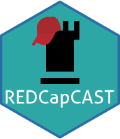

<!-- badges: start -->

[](https://github.com/agdamsbo/REDCapCAST) [](https://CRAN.R-project.org/package=REDCapCAST) [](https://doi.org/10.5281/zenodo.8013984) [](https://github.com/agdamsbo/REDCapCAST/actions/workflows/rhub.yaml) [](https://github.com/agdamsbo/REDCapCAST/actions/workflows/R-CMD-check.yaml) [](https://github.com/agdamsbo/REDCapCAST/actions/workflows/pages/pages-build-deployment) [](https://app.codecov.io/gh/agdamsbo/REDCapCAST?branch=master) [](https://cran.r-project.org/package=REDCapCAST) [](https://lifecycle.r-lib.org/articles/stages.html)

<!-- badges: end -->

# REDCapCAST package 

Casting metadata for REDCap database creation and handling of castellated data using repeated instruments and longitudinal projects in REDCap.

This is implemented with

-   An app-interface for easy database creation [accessible here](https://agdamsbo.shinyapps.io/redcapcast/) or available to run locally with `shiny_cast()` allowing you to easily create a REDCap database based on an existing spreadsheet.

-   Export data from REDCap in different formats handling castellated data, and on default only export requested data, this is mainly through `read_redcap_tables()`.

REDCapCAST was initially build on, and still includes code from [pegeler/REDCapRITS](https://github.com/pegeler/REDCapRITS), and relies on functions from the [`REDCapR`](https://ouhscbbmc.github.io/REDCapR/)-project

## History

This package was originally forked from [pegeler/REDCapRITS](https://github.com/pegeler/REDCapRITS). The `REDCapRITS` represents great and extensive work to handle castellated REDCap data in different programming languages. REDCapCAST has evolved into much more than just handling castellated data and so has been detatched from the original project while still relying on the main `REDCap_split` function. All access to the REDCap database is build on the outstanding work in [`REDCapR`](#0).

This package really started out of frustration during my PhD in health science hearing colleagues complaining about that "castellated" data formatting of REDCap exports when doing longitudinal projects and being used to wide data. This led to some bad decisions in building databases avoiding repeated instruments. This package solves these challenges, but solutions are also implemented else where like the [redcapAPI](https://github.com/vubiostat/redcapAPI) or [REDCapTidieR](https://github.com/CHOP-CGTInformatics/REDCapTidieR) packages, which are bigger project.

To help new PhD students and other researchers, I have also worked on creating a few helper/wrapper-functions to ease data access. Documentation is on it's way.

For any more advanced uses, consider using the [`redcapAPI`](https://github.com/vubiostat/redcapAPI) or [`REDCapR`](https://ouhscbbmc.github.io/REDCapR/) packages.

## Future

The plan with this package is to be bundled with a Handbook on working with REDCap from R. This work is in progress but is limited by the time available. Please feel free to contact me or create and issue with ideas for future additions.

## Installation and use

The package is available on CRAN. Install the latest version:

```         
install.packages("REDCapCAST")
```

Install the latest version directly from GitHub:

```         
require("remotes")
remotes::install_github("agdamsbo/REDCapCAST")
```

Launch the REDCapCAST app interface directly on your own machine:

```         
REDCapCAST::shiny_cast()
```

## Code of Conduct

Please note that the REDCapCAST project is released with a [Contributor Code of Conduct](https://agdamsbo.github.io/REDCapCAST/CODE_OF_CONDUCT.html). By contributing to this project, you agree to abide by its terms.
