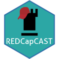

#  REDCapCAST app 

Welcome to the REDCapCAST app to create/cast REDCap database metadata. This is app allows you to create a new REDCap data base or instrument based on a simple spreadsheet.

## Disclaimer

This tool is aimed at demonstrating use of REDCapCAST. The app can be run locally or on a hosted server (will save no data anywhere). No responsibility for data loss or any other problems will be taken.

Also, this tool will not produce a ready-for-prime-time database, but it will be a comprehensive framework with suggestions for data-classes. You will need to go through your database afterwards and take your time to ensure everything is as you'd expect and work as intended.

## Overview

The functions of this app can be described in two parts:

1.  create REDCap metadata files like data dictionary or instrument based on a spreadsheet (.csv/.xls(x)/.dta/.ods) for download and manual upload to your REDCap server or

2.  upload the created database file and data to a given REDCap server via API access.

## Getting started

On the left, you initially just find one single option to upload a spreadsheet. Having done this, you can then preview the uploaded data and generated data dictionary by selecting the relevant tab on the top right.

### REDCap database files creation

The spreadsheet column names will be adjusted to comply with REDCap naming criteria, and a renamed (adjusted) spreadsheet can be downloaded. If your spreadsheet columns are labelled (exported from stata or labelled in R, these labels will be used for the visible field names (field label) i REDCap).

Based on the uploaded spreadsheet, the app will make a qualified guess on data classes and if the data is labelled (like .rda or .dta) all this information will be included in the data dictionary file. The default data format is "text". In addition categorical variables can be specified manually, and you caon add an ID column , or assume the first column is the ID (please reorder before export).

If you want to add data to an existing database, an instrument can be created. This metadata file is identical to a data dictionary, but does not include the ID field (if included or added) and is packaged as a .zip file, which is uploaded in the "Designer" interface in REDCap.

### Transferring directly to a REDCap database

This feature is mainly a show-case. Use it if you like, but most will feel more secure doing manual uploads.

Based on the API-functions in REDCap, you can upload your data dictionary and renamed data directly from this interface (no data is stored on the server, but consider launching this shiny app on your own machine after having installed the [REDCapCAST package](https://agdamsbo.github.io/REDCapCAST/#installation) in R). Launch a local instance of this app with:

```
REDCapCAST::shiny_cast()
```

Please mind you, that uploading a new data dictionary can delete data in your database and is non-reversible. Make sure to save a backup beforehand. Also, uploading a data dictionary to a server in production is not possible. This step is only advisable for newly created databases. See the "Disclaimer" above.

## Background

The main structure of variables of a REDCap database is defined by a so-called data dictionary. This is a simple spreadsheet file defining one or more instruments, data classes, branching logic and more. It does not contain any information on randomization, longitudinal data or repeatable instruments. These functions must be set up in the REDCap interface after having defined the data dictionary.

## Motivation

This tool has been created out of frustration with the lack of easy-to-use tools available and with a hope to help colleagues and others to easily create and extend REDCap databases.

## Use and feedback

Please, if you use this tool, don't hesitate to contact me with feedback if something doesn't work as expected. But, please also mind the disclaimer above. Contact information can be found on the [package documentation page](https://agdamsbo.github.io/REDCapCAST/).

## Citing

This app and package can be cited using the following bibtex citation or by referencing the following doi-identifier: [10.5281/zenodo.8013984](https://doi.org/10.5281/zenodo.8013984)

```
  @agdamsboREDCapCAST{,
    title = {REDCapCAST: REDCap Castellated Data Handling and Metadata Casting},
    author = {Andreas Gammelgaard Damsbo},
    year = {2024},
    note = {R package version 24.11.2, https://agdamsbo.github.io/REDCapCAST/},
    url = {https://github.com/agdamsbo/REDCapCAST},
    doi = {10.5281/zenodo.8013984},
  }
```
